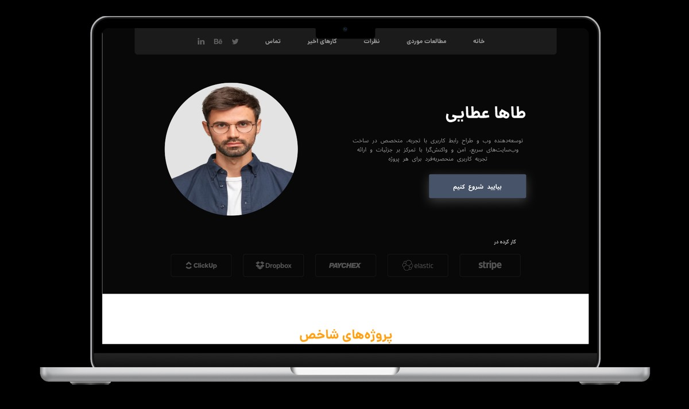

<p align="center">
  
</p>

<p align="center">
  
</p>

<p align="center">
  <a href="https://github.com/SHAKIB95/PersonalTemplate/actions/workflows/main.yml">
    
  </a>
  <a href="https://personal-template-fawn.vercel.app">
    
  </a>
</p>

---

## 📌 About The Project

A sleek, modern, and fully responsive single-page template designed for showcasing portfolios and projects. Built with a focus on simplicity, performance, and easy customization.

---

## ✨ Features

- **Fully Responsive Design**: Optimized for mobile, tablet, and desktop screens.
- **Interactive Slider**: Features a project slider powered by the robust **Swiper.js** library.
- **Dynamic Elements**: Off-canvas menu, scroll-to-top button, and form validation powered by **Alpine.js**.
- **Functional Contact Form**: Integrated with **EmailJS** to send emails directly from the client-side—no backend required.
- **Fast Development Environment**: Set up with **Vite** for a blazing-fast and optimized development experience.
- **Easy Customization**: Simple HTML structure and utility-first classes from **Tailwind CSS** make editing content and styles straightforward.

---

## 🛠️ Tech Stack

- **Vite**: A modern frontend build tool for a faster and leaner development experience.
- **Tailwind CSS**: A utility-first CSS framework for rapid UI development.
- **Alpine.js**: A rugged, minimal JavaScript framework for composing behavior directly in your markup.
- **Swiper.js**: A powerful library for creating touch sliders.
- **EmailJS**: A service to send emails from the client-side without a server.

---

## 🚀 Getting Started

To get a local copy up and running, follow these simple steps.

### Prerequisites
Ensure you have [Node.js](https://nodejs.org/) installed on your system.

### Installation & Setup

1.  **Clone the repository:**
    ```bash
    git clone [https://github.com/SHAKIB95/PersonalTemplate.git](https://github.com/SHAKIB95/PersonalTemplate.git)
    cd PersonalTemplate
    ```
2.  **Install NPM packages:**
    ```bash
    npm install
    ```
3.  **Run the development server:**
    ```bash
    npm run dev
    ```
    The project will be available at `http://localhost:5173` (or another port if the current one is in use).

---

## ⚙️ Configuration

### Contact Form (EmailJS)

To get the contact form working, you need to set up your personal keys from EmailJS.

1.  Create a `.env` file in the root of the project.
2.  Copy the contents of `.env.example` (if it exists) or add the following variables to your new `.env` file:
    ```env
    VITE_EMAILJS_SERVICE_ID=your_service_id
    VITE_EMAILJS_TEMPLATE_ID=your_template_id
    VITE_EMAILJS_PUBLIC_KEY=your_public_key
    ```
3.  Replace the placeholder values with your actual keys from your EmailJS account.

**IMPORTANT**: The `.env` file should not be committed to GitHub. Ensure it is listed in your `.gitignore` file.

---

## 📄 License

Distributed under the MIT License. See `LICENSE` for more information.
